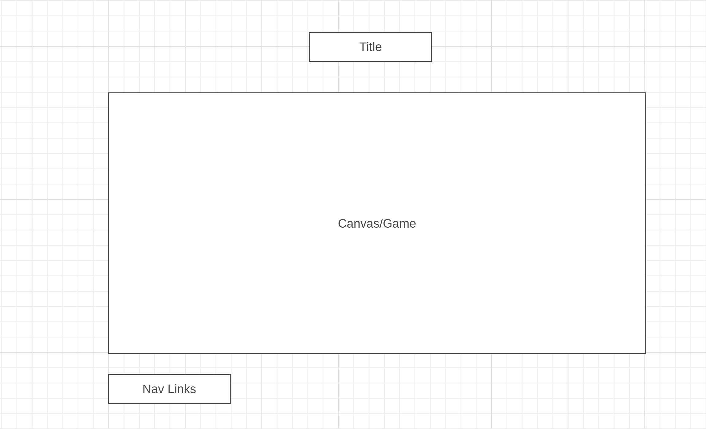

#RUN KAKASHI RUN

## 1. Background and Overview

Run Kakashi Run is an iteration of one of the most famous games that have ever been made. Side Scrollers. Players will be running across land and will have to dodge obstacles and survive as long as they can. There will be unmoving and moving objects that will appear along your path, and your goal is to run as far as you can.

Here is a footage of gameplay.


## 2. Functionality and MVPS

Users will be able to:

* Start a game where-in a randomized environment will be setup.
* Rocks and fireballs will spawn automatically in random intervals.
* Player will be able to either jump to dodge rocks or jump/slide to dodge fireballs.

## 3. Wireframes



## 4. Technologies

* Vanilla Javascript - was used to create game logic and functionality of player.
* CanvasHTML - was used to layer graphics onto page and animate.
* CSS - was used to style the splash page and text.
* webpack - was used to build the module.

## 5. Highlighted Feature

The below Code scrolls different background layers at different speeds to for depth perception and distance.

```javascript
    createBackground(bgCtx, treeCtx, grassCtx) {
        const bgImage = new Image();
        bgImage.src = backgroundWaterSrc;
        this.bg = new Background(bgCtx, bgImage, -35, 1400, 0.5);

        const treeImage = new Image();
        treeImage.src = darkTreesSrc;
        this.tree = new Background(treeCtx, treeImage, 115, 400, 1.5);

        const grassImage = new Image();
        grassImage.src = grassSrc;
        this.grass = new Background(grassCtx, grassImage, 263, 400, 2.5);
    }
```

The below snippet of Code animates the fireball by pulling a sprite depending on how many frames has passed. Then we draw onto the canvas by giving the params needed for canvas drawImage function.

```javascript
getFrame() {
        if (this.fireAnimation < 5) {
            this.fireAnimation += 1;
            return FIRESPRITE.fire1;
        } else if (this.fireAnimation < 10) {
            this.fireAnimation += 1;
            return FIRESPRITE.fire2;
        } else if (this.fireAnimation < 15) {
            this.fireAnimation += 1;
            return FIRESPRITE.fire3;
        } else if (this.fireAnimation < 20) {
            this.fireAnimation += 1;
            return FIRESPRITE.fire4;
        } else {
            this.fireAnimation = 0;
            return FIRESPRITE.fire1;
        }
    }

    draw(ctx) {
        ctx.beginPath();
        const sprite = this.getFrame();
        ctx.drawImage(
            this.fireSprites, //image
            sprite[0], //sx
            sprite[1], //sy
            sprite[2], //sWidth
            sprite[3], //sHeight
            this.position[0], //dx
            this.position[1], //dy
            sprite[2], //dWidth
            sprite[3] //dHeight
        );
    }
```

## 6. Bonus Features/ Future implementation

* Create character powerups that allow timed ability (ex/ shooting projectiles).
* Create more characters that have different abilities. (ex/ jump multiple times)